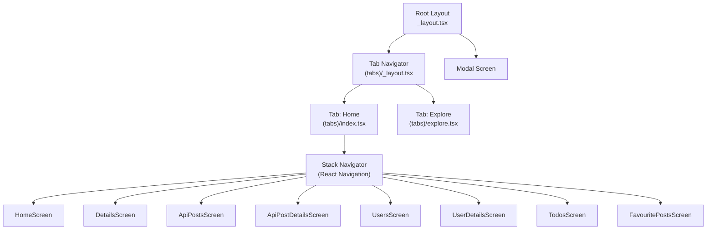
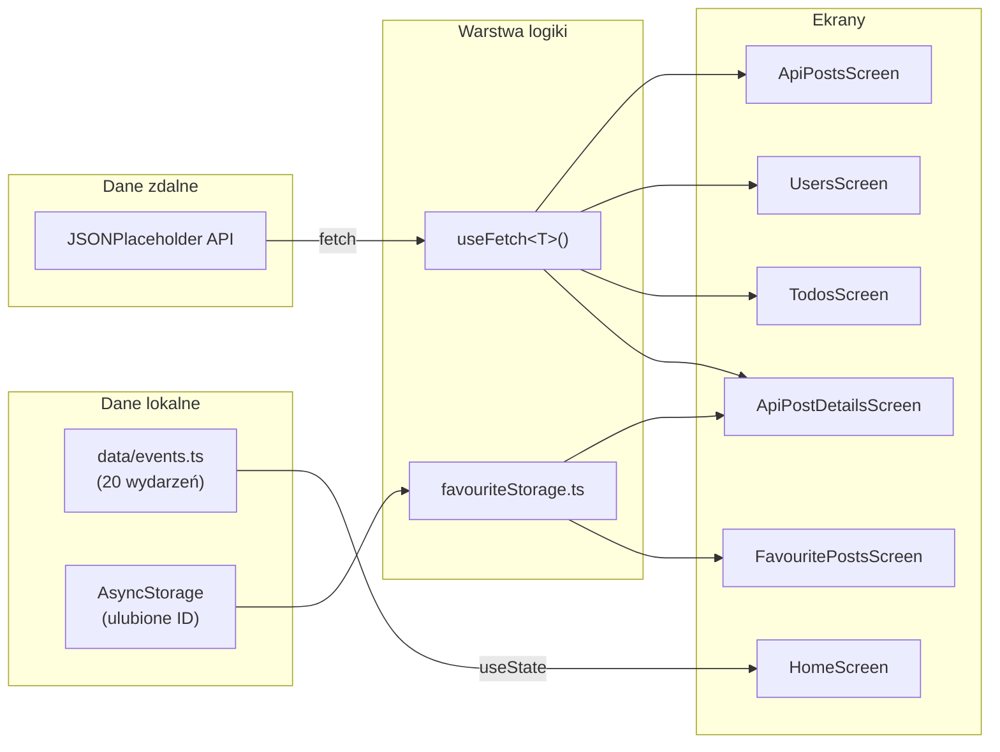

# 🎓 Przygotowanie do obrony projektu — Smart Campus

## 1. Co to za projekt? (Elevator pitch)

> **Smart Campus** to mobilna aplikacja napisana w **React Native** z użyciem **Expo** i **TypeScript**. Służy do przeglądania wydarzeń kampusowych, postów z zewnętrznego API, listy użytkowników, zadań (to-do) oraz zarządzania ulubionymi postami. Dane lokalne (wydarzenia) są zdefiniowane statycznie, natomiast dane zdalne pobierane są z publicznego API **JSONPlaceholder**.

---

## 2. Stos technologiczny

| Technologia | Rola | Wersja |
|---|---|---|
| **React Native** | Framework mobilny (UI) | 0.81.5 |
| **Expo** | Platforma dev, bundler, narzędzia | ~54.0 |
| **Expo Router** | Routing plikowy (file-based) | ~6.0 |
| **React Navigation** | Stack nawigacja w zakładce Home | 7.x |
| **TypeScript** | Statyczne typowanie | ~5.9 |
| **AsyncStorage** | Trwałe przechowywanie danych (ulubione) | 2.2.0 |
| **React Native Reanimated** | Animacje | ~4.1 |
| **JSONPlaceholder** | Darmowe, publiczne REST API do testów | — |

### Jak uruchomić projekt?
```bash
npm install       # instalacja zależności
npm start         # uruchamia Expo dev server (expo start)
# Potem: skanuj QR w Expo Go (Android/iOS) lub wciśnij 'w' dla web
```

---

## 3. Struktura projektu (drzewo katalogów)

```
my-app-main-main/
├── app/                          # ← GŁÓWNY katalog aplikacji
│   ├── _layout.tsx               # Root layout (ThemeProvider + Stack)
│   ├── modal.tsx                 # Ekran modalny
│   ├── (tabs)/                   # Nawigacja zakładkowa (Tab Navigator)
│   │   ├── _layout.tsx           # Konfiguracja zakładek (Home, Explore)
│   │   ├── index.tsx             # Zakładka "Home" — Stack Navigator z 8 ekranami
│   │   └── explore.tsx           # Zakładka "Explore" — dokumentacja/pomoc
│   ├── screens/                  # Ekrany (widoki) aplikacji
│   │   ├── HomeScreen.tsx        # Ekran główny — lista wydarzeń + formularz
│   │   ├── DetailsScreen.tsx     # Szczegóły lokalnego wydarzenia
│   │   ├── ApiPostsScreen.tsx    # Lista postów z API
│   │   ├── ApiPostDetailsScreen.tsx  # Szczegóły posta + ulubione
│   │   ├── UsersScreen.tsx       # Lista użytkowników z API
│   │   ├── UserDetailsScreen.tsx # Szczegóły użytkownika
│   │   ├── TodosScreen.tsx       # Lista zadań (to-do) z API
│   │   ├── FavouritePostsScreen.tsx  # Ulubione posty
│   │   ├── HomeScreenStyles.ts   # Style dla HomeScreen
│   │   └── DetailsScreenStyles.ts    # Style dla DetailsScreen
│   └── services/                 # Warstwa serwisowa (logika biznesowa)
│       └── favouriteStorage.ts   # CRUD dla ulubionych (AsyncStorage)
├── components/                   # Komponenty wielokrotnego użytku
│   ├── AddEventForm.tsx          # Formularz dodawania wydarzeń
│   ├── ListItem.tsx              # Element listy wydarzeń
│   ├── ListItemStyles.ts         # Style ListItem
│   ├── ListItemTypes.ts          # Typy dla ListItem
│   ├── ApiPostItem.tsx           # Element listy postów API
│   ├── UserItem.tsx              # Element listy użytkowników
│   ├── TodoItem.tsx              # Element listy zadań
│   ├── Header.tsx                # Nagłówek
│   └── ui/                       # Niskopoziomowe komponenty UI
├── types/                        # Definicje typów TypeScript
│   ├── Event.ts                  # interface Event
│   ├── Post.ts                   # type Post
│   ├── User.ts                   # type User
│   ├── Todo.ts                   # type Todo
│   ├── Comment.ts                # type Comment
│   ├── Navigation.ts             # RootStackParamList — mapa nawigacji
│   ├── DetailsScreenTypes.ts     # Typy props dla DetailsScreen
│   └── HomeScreenTypes.ts        # Typy props dla HomeScreen
├── hooks/                        # Niestandardowe hooki React
│   └── useFetch.ts               # Uniwersalny hook do pobierania danych z API
├── data/                         # Dane statyczne
│   └── events.ts                 # 20 predefiniowanych wydarzeń
├── constants/                    # Stałe konfiguracyjne
│   ├── theme.ts                  # Kolory (light/dark) i fonty
│   └── storageKeys.ts            # Klucze AsyncStorage
├── assets/images/                # Zasoby graficzne
├── package.json                  # Zależności i skrypty
└── tsconfig.json                 # Konfiguracja TypeScript
```

---

## 4. Architektura aplikacji

### 4.1. System nawigacji (dwa poziomy)



> [!IMPORTANT]
> Aplikacja używa **dwóch systemów nawigacji jednocześnie**:
> 1. **Expo Router** (plikowy) — na najwyższym poziomie tworzy zakładki (tabs) i modal
> 2. **React Navigation (Native Stack)** — wewnątrz zakładki "Home" zarządza 8 ekranami ze stosem nawigacji

Komponent `NavigationIndependentTree` opakowuje React Navigation, pozwalając mu działać niezależnie od Expo Router.

### 4.2. Przepływ danych



---

## 5. Kluczowe elementy kodu

### 5.1. Custom Hook: `useFetch<T>` — generyczny hook do pobierania danych

**Plik:** [useFetch.ts](file:///c:/Users/user/Desktop/my-app-main-main/hooks/useFetch.ts)

```typescript
export function useFetch<T>(url: string): UseFetchResult<T> {
    const [data, setData] = useState<T | null>(null);
    const [isLoading, setIsLoading] = useState<boolean>(true);
    const [error, setError] = useState<string>("");

    useEffect(() => {
        const fetchData = async () => {
            try {
                setIsLoading(true);
                const response = await fetch(url);
                if (!response.ok) throw new Error("...");
                const json = (await response.json()) as T;
                setData(json);
            } catch (err) {
                setError("Wystąpił błąd...");
            } finally {
                setIsLoading(false);
            }
        };
        fetchData();
    }, [url]);

    return { data, isLoading, error };
}
```

**Co musisz wiedzieć:**
- Jest **generyczny** (`<T>`) — obsługuje `Post[]`, `User[]`, `Todo[]`, `Post`, `User`, `Comment[]`
- Używa `useEffect` z zależnością `[url]` — re-fetchuje gdy URL się zmieni
- Zwraca obiekt z trzema stanami: `data`, `isLoading`, `error`
- Obsługuje **trzy stany UI**: ładowanie (spinner), błąd (komunikat), sukces (dane)

### 5.2. Serwis `favouriteStorage` — persystencja danych

**Plik:** [favouriteStorage.ts](file:///c:/Users/user/Desktop/my-app-main-main/app/services/favouriteStorage.ts)

Serwis opakowuje `AsyncStorage` i zapewnia 5 operacji CRUD:

| Funkcja | Opis |
|---|---|
| `getFavouritePosts()` | Pobiera tablicę ID ulubionych postów |
| `saveFavouritePosts(ids)` | Zapisuje tablicę ID do AsyncStorage |
| `addFavouritePostId(id)` | Dodaje ID (sprawdza duplikaty) |
| `removeFavouritePostId(id)` | Usuwa ID (filtruje tablicę) |
| `isFavouritePostId(id)` | Sprawdza czy post jest ulubiony |

**Jak to działa:**
1. Dane przechowywane jako **JSON string** w AsyncStorage pod kluczem `"favouritePosts"`
2. Przy każdej operacji odczytuje aktualny stan → modyfikuje → zapisuje z powrotem
3. `AsyncStorage` jest **asynchroniczne** — wszystkie operacje zwracają `Promise`

### 5.3. Formularz `AddEventForm` — walidacja i zarządzanie stanem

**Plik:** [AddEventForm.tsx](file:///c:/Users/user/Desktop/my-app-main-main/components/AddEventForm.tsx)

- Każde pole formularza to osobny `useState`
- **Walidacja przed dodaniem:** sprawdza czy pola nie są puste, czy tytuł ma ≥ 3 znaki
- Po sukcesie: wywołuje callback `onAddEvent`, czyści formularz, pokazuje Alert
- Typ `Omit<Event, "id">` — nowe wydarzenie nie ma jeszcze ID (generowane przez `Date.now()`)

### 5.4. Mapa nawigacji `RootStackParamList`

**Plik:** [Navigation.ts](file:///c:/Users/user/Desktop/my-app-main-main/types/Navigation.ts)

```typescript
export type RootStackParamList = {
  Home: undefined;                    // brak parametrów
  Details: { id, title, description, location, date, category, speaker };  // pełne dane
  ApiPosts: undefined;
  ApiPostDetails: { id: number };     // tylko ID → reszta z API
  Users: undefined;
  UserDetails: { id: number };        // tylko ID → reszta z API
  Todos: undefined;
  FavouritePosts: undefined;
};
```

> [!NOTE]
> Ten typ zapewnia **bezpieczeństwo typów przy nawigacji**. Jeśli na przykład napiszesz `navigation.navigate("Details")` bez wymaganych parametrów, TypeScript zgłosi błąd kompilacji.

---

## 6. Opis ekranów

### 6.1. HomeScreen — Ekran główny
- Wyświetla tytuł "Smart Campus"
- Zawiera 4 przyciski nawigacyjne (→ ApiPosts, Users, Todos, FavouritePosts)
- Formularz dodawania wydarzeń (`AddEventForm`)
- Lista wydarzeń (`FlatList` + `ListItem`) — klikalne, prowadzą do `DetailsScreen`
- Stan wydarzeń zarządzany przez `useState<Event[]>`
- Nowe wydarzenia dodawane na **początek** listy (`[newEvent, ...prev]`)

### 6.2. DetailsScreen — Szczegóły wydarzenia
- Otrzymuje **wszystkie dane** przez parametry nawigacji (nie pobiera z API)
- Wyświetla kartę ze szczegółami: kategoria, tytuł, prowadzący, data, lokalizacja, opis
- Style wydzielone do osobnego pliku `DetailsScreenStyles.ts`

### 6.3. ApiPostsScreen — Posty z API
- Pobiera dane z `https://jsonplaceholder.typicode.com/posts` (100 postów)
- Używa `useFetch<Post[]>`
- Obsługuje 3 stany: loading → error → lista
- Kliknięcie → `ApiPostDetailsScreen` z `id` posta

### 6.4. ApiPostDetailsScreen — Szczegóły posta
- Pobiera **dwa zasoby równolegle**: post (`/posts/{id}`) i komentarze (`/posts/{id}/comments`)
- Funkcja "ulubione" — toggle przycisk, persystencja w AsyncStorage
- Wyświetla ID posta i liczbę komentarzy

### 6.5. UsersScreen → UserDetailsScreen
- Lista użytkowników z API → kliknięcie → szczegóły (imię, username, email, telefon, strona www)
- Schemat identyczny jak posty: `useFetch` → `FlatList` → nawigacja z `id`

### 6.6. TodosScreen — Lista zadań
- Pobiera zadania z API, wyświetla **max 20** (`todos.slice(0, 20)`)
- Każde zadanie ma badge "Wykonane" (zielony) lub "Niewykonane" (czerwony)
- Ukończone zadania mają przekreślony tytuł (`textDecorationLine: "line-through"`)

### 6.7. FavouritePostsScreen — Ulubione posty
- Odczytuje ID z `AsyncStorage` przy montowaniu (`useEffect`)
- Przycisk "Odśwież" pozwala przeładować listę
- Wyświetla ID ulubionych postów lub komunikat "Brak ulubionych postów"

---

## 7. Wzorce i dobre praktyki zastosowane w projekcie

| Wzorzec / Praktyka | Gdzie zastosowany | Opis |
|---|---|---|
| **Separacja typów** | `types/` | Każdy model danych ma osobny plik TypeScript |
| **Custom Hook** | `useFetch.ts` | Logika pobierania danych wydzielona z komponentów |
| **Generyczność** | `useFetch<T>` | Jeden hook obsługuje różne typy danych |
| **Separacja styli** | `*Styles.ts` | Style w osobnych plikach (np. `HomeScreenStyles.ts`) |
| **Warstwa serwisowa** | `services/` | Logika persystencji oddzielona od UI |
| **Typowana nawigacja** | `RootStackParamList` | TypeScript pilnuje poprawności parametrów nawigacji |
| **Komponent prezentacyjny** | `ListItem`, `TodoItem` | Komponenty bezstanowe, otrzymują dane przez props |
| **Utility type Omit** | `AddEventForm` | `Omit<Event, "id">` — typ eventu bez pola ID |
| **Obsługa stanów** | Każdy ekran API | Trzy stany: loading / error / success |
| **Stałe** | `constants/` | Klucze storage, kolory, fonty w jednym miejscu |

---

## 8. Potencjalne pytania na obronie + odpowiedzi

### 📌 Pytania ogólne o projekt

**P1: Czym jest ta aplikacja? Jaki jest jej cel?**
> Smart Campus to mobilna aplikacja kampusowa, która pozwala przeglądać wydarzenia uczelni, dodawać nowe, przeglądać posty, użytkowników i zadania z zewnętrznego API, a także zapisywać ulubione posty lokalnie.

**P2: Jakie technologie zostały użyte i dlaczego?**
> React Native z Expo — bo umożliwia tworzenie aplikacji na Android, iOS i web z jednego kodu. TypeScript — dla bezpieczeństwa typów. AsyncStorage — do trwałego przechowywania ulubionych postów. JSONPlaceholder — jako testowe API REST do demonstracji pobierania danych.

**P3: Jak uruchomić projekt?**
> `npm install` → `npm start` → skanowanie kodu QR w aplikacji Expo Go lub wciśnięcie `w` dla wersji webowej.

---

### 📌 Pytania o architekturę

**P4: Jaka jest struktura nawigacji w aplikacji?**
> Używam dwóch systemów nawigacji. Na najwyższym poziomie Expo Router zarządza zakładkami (Home, Explore) i modalem. Wewnątrz zakładki Home mam React Navigation Stack Navigator z 8 ekranami. Komponent `NavigationIndependentTree` pozwala tym dwóm systemom współistnieć.

**P5: Dlaczego użyto dwóch systemów nawigacji?**
> Expo Router zapewnia file-based routing (plikowy) — ułatwia konfigurację zakładek. Ale wewnątrz jednej zakładki potrzebowałem stack nawigacji z przekazywaniem parametrów między ekranami, co było wygodniejsze przez React Navigation.

**P6: Jak dane przepływają w aplikacji?**
> Są dwa źródła: dane statyczne (lokalne wydarzenia w `data/events.ts`) i dane zdalne (JSONPlaceholder API). Dane zdalne pobierane są przez hook `useFetch`. Ulubione posty są zapisywane w AsyncStorage i obsługiwane przez serwis `favouriteStorage.ts`.

---

### 📌 Pytania o TypeScript

**P7: Jak TypeScript pomaga w nawigacji?**
> Typ `RootStackParamList` definiuje wszystkie ekrany i ich parametry. Dzięki temu gdy wywołuję `navigation.navigate("Details", {...})`, TypeScript weryfikuje w czasie kompilacji, czy przekazuję wszystkie wymagane parametry z poprawnymi typami.

**P8: Co to jest `Omit<Event, "id">` i dlaczego jest użyty?**
> `Omit` to utility type TypeScripta, który tworzy nowy typ bez wskazanego pola. W formularzu dodawania wydarzeń nie chcę, aby użytkownik podawał ID — jest generowane automatycznie przez `Date.now()`. Więc `Omit<Event, "id">` daje mi typ z polami title, description, location, itd., ale bez id.

**P9: Po co osobne pliki typów (types/)?**
> Dla separacji odpowiedzialności. Modele danych (`Event`, `Post`, `User`, `Todo`, `Comment`) są współdzielone między ekranami, hookami i komponentami — trzymanie ich w osobnym katalogu centralizuje definicje i eliminuje duplikację.

---

### 📌 Pytania o hooki i stan

**P10: Jak działa hook `useFetch`?**
> Jest to generyczny custom hook, który przyjmuje URL, wykonuje `fetch` w `useEffect`, i zwraca obiekt z trzema wartościami: `data` (dane lub null), `isLoading` (boolean), `error` (string). Hook automatycznie ponawia zapytanie, gdy zmieni się URL.

**P11: Dlaczego `useFetch` jest generyczny?**
> Bo jest używany do pobierania różnych typów danych: `Post[]`, `User[]`, `Todo[]`, `Post`, `User`, `Comment[]`. Generyczność (`<T>`) pozwala jednemu hookowi obsłużyć wszystkie te typy z pełnym bezpieczeństwem typów.

**P12: Jak jest zarządzany stan wydarzeń na HomeScreen?**
> Początkowe wydarzenia ładowane są z pliku `data/events.ts` do `useState<Event[]>`. Nowe wydarzenia dodawane przez formularz trafiają na początek tablicy dzięki operatorowi spread: `[newEvent, ...prevEvents]`. Stan jest lokalny — nie jest zapisywany po zamknięciu aplikacji.

**P13: Czym jest `useEffect` i jak jest użyty w projekcie?**
> `useEffect` to hook React wykonujący efekty uboczne. W `useFetch` uruchamia zapytanie HTTP po zamontowaniu komponentu. W `ApiPostDetailsScreen` sprawdza w AsyncStorage czy post jest ulubiony. W `FavouritePostsScreen` ładuje listę ulubionych.

---

### 📌 Pytania o persystencję danych

**P14: Jak działają ulubione posty?**
> W `ApiPostDetailsScreen` przycisk toggleuje stan. Przy dodaniu — `addFavouritePostId` dodaje ID do tablicy w AsyncStorage (sprawdzając duplikaty). Przy usunięciu — `removeFavouritePostId` filtruje tablicę. `FavouritePostsScreen` odczytuje zapisane ID i wyświetla je.

**P15: Czym jest AsyncStorage?**
> To odpowiednik `localStorage` z przeglądarki, ale dla React Native. Pozwala przechowywać pary klucz-wartość (stringi) trwale na urządzeniu. Dane przetrwają zamknięcie aplikacji. Jest asynchroniczne — operacje zwracają Promise.

**P16: Dlaczego ulubione posty przechowują tylko ID, a nie całe obiekty?**
> Bo to wystarczy. ID zajmują mniej pamięci niż pełne obiekty. Jeśli kiedyś potrzebowałbym wyświetlać szczegóły ulubionych, mogę pobrać dane z API na podstawie ID.

---

### 📌 Pytania o komponenty

**P17: Czym się różnią komponenty prezentacyjne od kontenerowych?**
> Prezentacyjne (np. `ListItem`, `TodoItem`, `UserItem`) — tylko wyświetlają dane otrzymane przez props, nie mają własnego stanu. Kontenerowe (np. `HomeScreen`, `ApiPostsScreen`) — zarządzają stanem, pobierają dane, obsługują nawigację.

**P18: Jak działa walidacja formularza w `AddEventForm`?**
> Przed dodaniem wydarzenia sprawdzam: 1) czy wszystkie pola są wypełnione, 2) czy tytuł ma minimum 3 znaki, 3) czy data nie jest pusta. Jeśli walidacja nie przejdzie, wyświetlam Alert z komunikatem błędu.

**P19: Dlaczego `ListItem` ma pola: title, description, location, category, speaker, isHighlighted?**
> Bo reprezentuje element listy wydarzeń kampusowych. `isHighlighted` to opcjonalna flaga, która zmienia tło elementu na niebieskie — umożliwia wizualne wyróżnienie ważnych wydarzeń.

---

### 📌 Pytania o API i fetch

**P20: Skąd pochodzą dane w aplikacji?**
> Dwa źródła: 1) **Lokalne** — 20 wydarzeń w `data/events.ts` (dane hardcoded). 2) **Zdalne** — JSONPlaceholder (`https://jsonplaceholder.typicode.com/`) — publiczne, darmowe REST API z postami, użytkownikami, todosami i komentarzami.

**P21: Jak aplikacja obsługuje błędy sieciowe?**
> Hook `useFetch` ma blok try/catch. Jeśli `response.ok` jest false (np. 404, 500), rzucam wyjątek. W catch ustawiam `error` na komunikat tekstowy. Każdy ekran sprawdza ten stan i wyświetla odpowiedni komunikat zamiast pustej strony.

**P22: Co się stanie gdy nie ma internetu?**
> `fetch` rzuci wyjątek (np. `TypeError: Network request failed`). Hook przechwyci go w `catch` i ustawi komunikat błędu. Ekran wyświetli tekst "Wystąpił błąd podczas pobierania danych" zamiast listy.

---

### 📌 Pytania o stylowanie

**P23: Jak są zorganizowane style w projekcie?**
> Używam `StyleSheet.create()` z React Native. Proste style są w tym samym pliku co komponent (np. `ApiPostsScreen`). Bardziej złożone style wydzielone do osobnych plików (np. `HomeScreenStyles.ts`, `ListItemStyles.ts`). Motyw kolorystyczny w `constants/theme.ts`.

**P24: Czy aplikacja obsługuje tryb ciemny?**
> Na poziomie root layout tak — `ThemeProvider` z React Navigation automatycznie przełącza między `DarkTheme` i `DefaultTheme` na podstawie `useColorScheme()`. Ale ekrany w Stack Navigator mają hardcoded kolory (np. `backgroundColor: "#fff"`), więc de facto tryb ciemny działa głównie w zakładce Explore.

---

### 📌 Pytania o Expo i React Native

**P25: Czym jest Expo i jakie daje korzyści?**
> Expo to platforma, która upraszcza tworzenie aplikacji React Native. Zapewnia gotowe narzędzia: dev server, hot reload, dostęp do API urządzenia (kamera, lokalizacja), system buildowania i dystrybucji. Nie trzeba konfigurować Xcode ani Android Studio do developmentu.

---

## 9. Wskazówki na obronę

> [!TIP]
> **Jak opowiadać o projekcie:**
> 1. Zacznij od **ogólnego opisu** — co to za aplikacja, dla kogo, co robi
> 2. Przejdź do **technologii** — React Native, Expo, TypeScript, dlaczego te wybory
> 3. Pokaż **strukturę projektu** — katalogi, podział odpowiedzialności
> 4. Omów **kluczowe wzorce** — custom hook `useFetch`, serwis favouriteStorage, typowana nawigacja
> 5. Pokaż **działanie aplikacji** — odpal ją i pokaż każdy ekran

> [!WARNING]
> **Czego unikać:**
> - Nie mów "skopiowałem to z tutoriala" — opisuj jako świadome decyzje
> - Nie mów "nie wiem" — lepiej "to jest obszar, który chciałbym dalej rozwijać"
> - Nie czytaj z kartki — mów swoimi słowami, pokaż że rozumiesz

> [!IMPORTANT]
> **Gotowość sprawdzisz tak:** Zamknij ten dokument i spróbuj odpowiedzieć na powyższe pytania z pamięci. Jeśli potrafisz odpowiedzieć na 20+ pytań bez zaglądania — jesteś gotowy.
